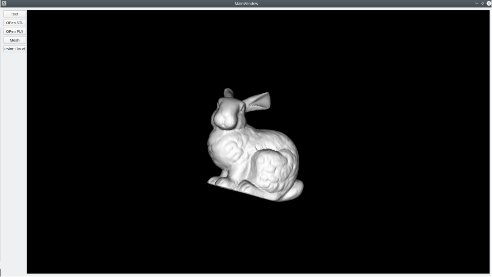
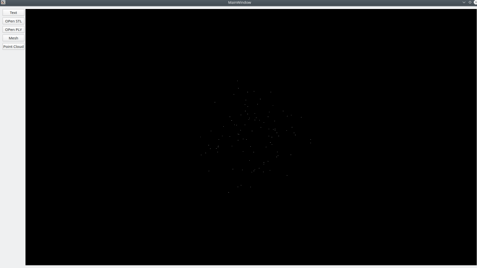
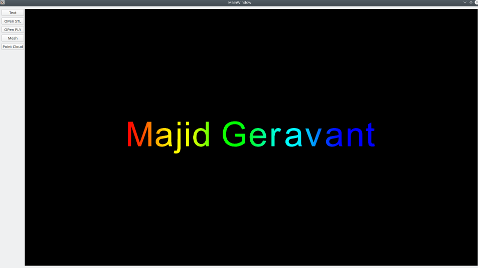

# p_demo_02_3d

Requirement
------------
    Qt5:
    ----
        mkdir qt5 && cd qt5
        wget http://download.qt-project.org/official_releases/qt/5.X.X.X.run
        chmod +x 5.X.X.X.run
        ./qt-opensource-linux-x64-5.X.X.X.run
    vtk:
    ----
        Download the vtk version 8.2
        cd (vtk directory)
        mkdir build
        cd build
        cmake -DVTK_QT_VERSION:STRING=5 -DQT_QMAKE_EXECUTABLE:PATH=~/SW/Qt/5.13.1/gcc_64/bin/qmake -DVTK_Group_Qt:BOOL=ON -DCMAKE_PREFIX_PATH:PATH=~/SW/Qt/5.13.1/gcc_64/lib/cmake -DBUILD_SHARED_LIBS:BOOL=ON ../
        make -j 7
        sudo make install
        sudo ldconfig
